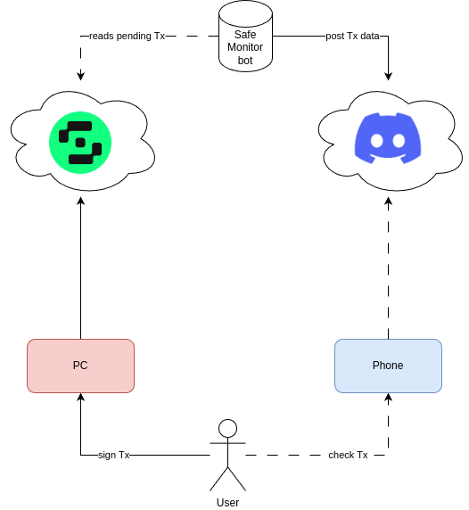

# Safe-Monitor

## What is this project?

The goal of this project is to monitor **new** pending transactions for Safe Wallets.

It can be used as an alternative way to get data from the Safe servers.
This can be particularly useful to check the transaction hash you are going to sign.

You are signing from an untrusted computer? Take **your phone**, read the transaction hash from Discord
to increase confidence of its validity.

*Note: This project can be used as a sort of 2FA. :warning: This is not a security recommendation!!! :warning:*



### The hashes are different, why?

If the hash you read from your Safe Wallet interface is different than the hash you read from your phone on Discord, then there is an issue.

You most likely should investigate further to understand if you have been compromised.

### Critical points

If the Discord of the admin responsible for the bot is compromised, then the bot may also be compromised.

## How to set up?

First, copy the `.env.example` file into `.env` and set up your sensitive settings.

```file
PARAMS_FILE="./params.json"
DISCORD_CHANNEL_ID=""
DISCORD_TOKEN=""
```

Then, set up your settings in `params.json`:

```json
{
    "safe-transaction-url": "",
    "safeWalletAddresses": [
        "YOUR_SAFE_WALLET_ADDRESS"
    ],
    "chainId": "CHAIN_ID"
}
```

You are good to go!

## How to start?

To run the production mode:
```bash
npm install
npm run build
npm start
```


To run the dev mode:
```bash
npm install
npm run dev
```

## Contributions

Do not hesitate to open a PR to contribute to the project!
